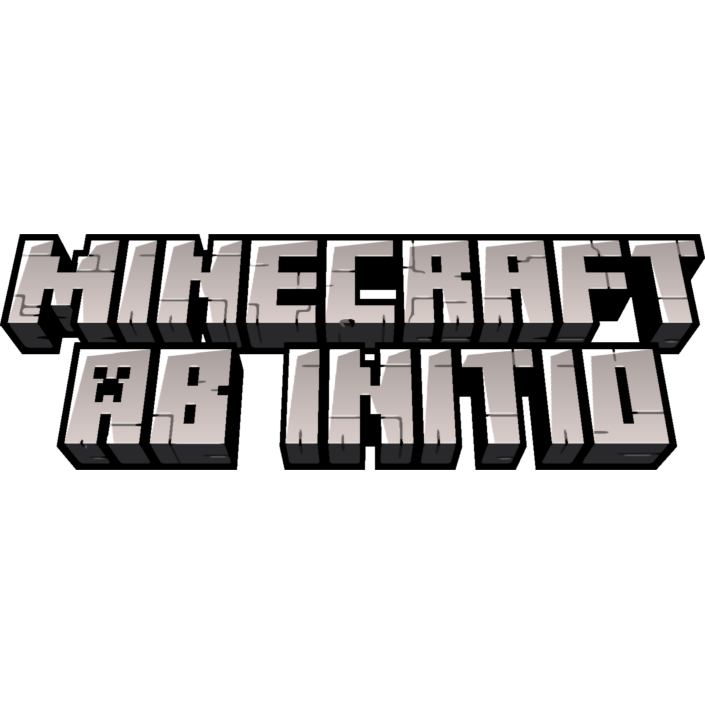

# Planned Content in this Mod
- Sieve Block and Recipe Type.
- Sieve that gets Powered by Mechanical Energy if Create is installed.

Sieve

Clay Bucket
Hammer

Steinchen -> Dirt

Steinchen -> Cobble

Wie String ?

Plant Fiber -> Thin Rope

======== Wooden Shear ========
Shaped Recipe

W = Wooden Planks

 W
W

======== Plant Fiber ========
Shapeless Recipe

L = Leaves

1x L -> 1x Plant Fiber

======== Thin Rope ========
Shaped Recipe

P = Plant Fiber

PPP

======== Thick Rope ========
Shapeless Recipe

T = Thin Rope

TT

======== Sieve ========
Shaped Recipe

W = Wooden Planks 

S = Thin Rope

WSW
W W
